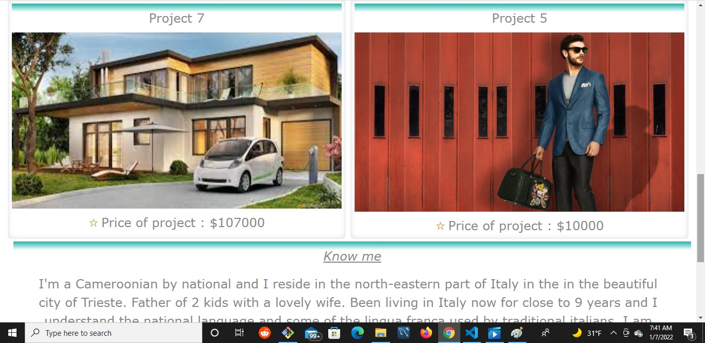

# achristiann

***GIT HUB LINKS***
    [Github pages](https://tochiskool.github.io/achristiann/)
    [View commits](https://github.com/Tochiskool/achristiann)
## Project structure
**Project is intended to be a MERN stack project that displays my work as a Full-stack dev. It is practically my official portfolio.**
- Starting a basic structure with a fluid-like modular and scalable frontend end using html and css with the intensions of turning it to a react/react-router front end to create a beautiful UI that will be accessible and user friendly.
* So far I have used several basic and advance techniques to achieve the UI and am hoping to add more friendly features. 
### INTERESTING TOPICS SO FAR
    - Pseudo class
    - Pseudo elements
    - Flexbox and grid 
    - Css positioning techniques
    - Tooltips

**NOTE the magic**
* *Buy me button appears as you hover on cards*.
* *Cars are highlighted to seemingly look like they picked*.
* *How some characters in words are ginormous*.

##  ***PICTURES***

**HEADER**

**MAIN**

**FOOTER**